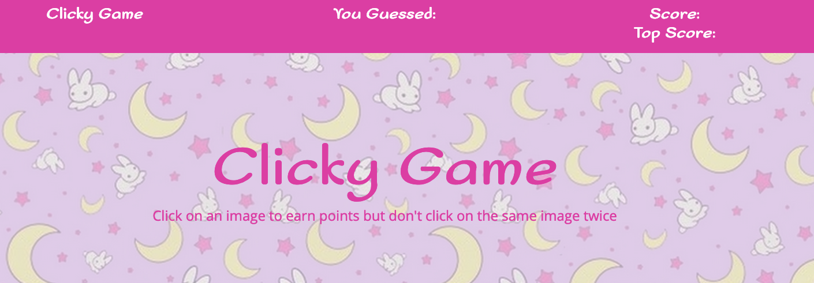
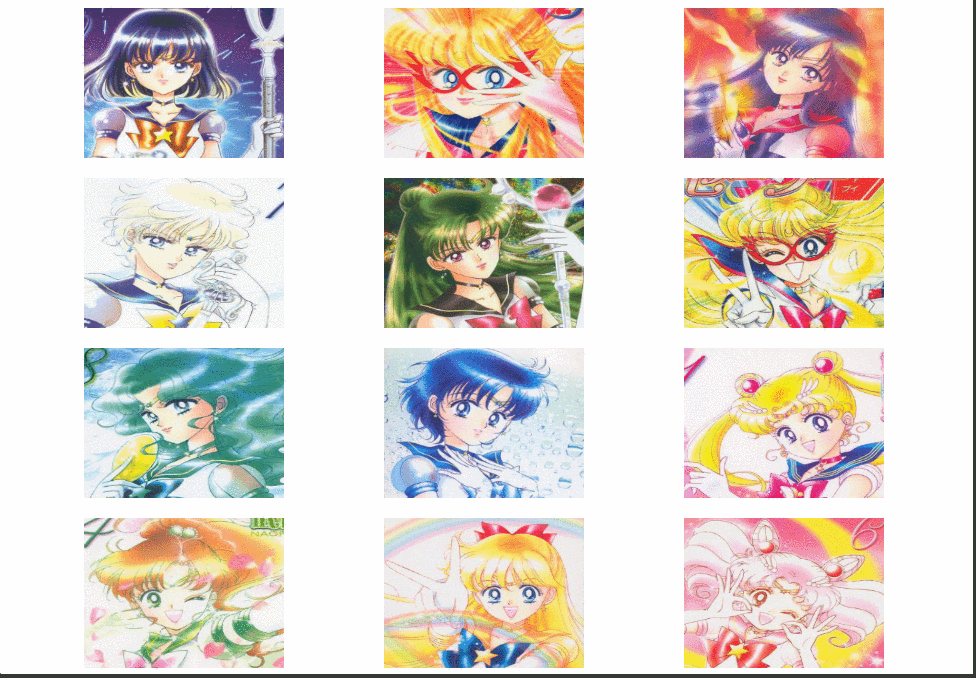

# Clicky Game

Interactive memory game built with React. The applicatiion's UI components are broken up and component states are managed to respond to user events. 

## How It Works

1. Earn points by clicking an image for the first time. The user's score will increment by 1 for each correct guess.

2. Every time an image is clicked, the images will shuffle themselves in a random order.

3. If the user choses an image that has already been selected, the game is over and will be reset back to 0 and the game starts over. 

## Project Details

### Technologies Used
* React
* HTML5
* CSS
* Bootstrap